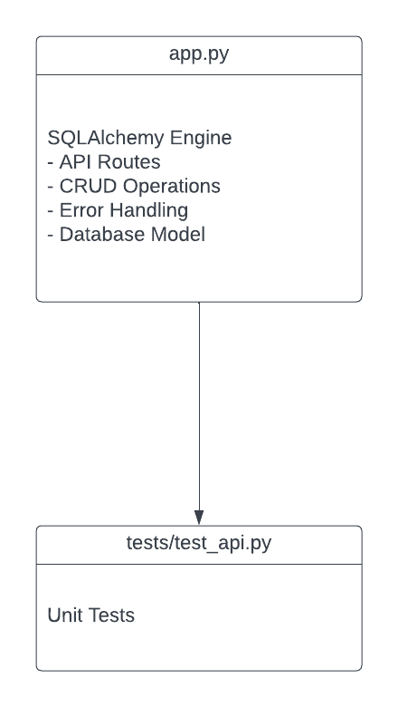

# Simple Person REST API

## Introduction

This is a simple REST API project for managing a "person" resource. The API provides endpoints for Create, Read, Update, and Delete (CRUD) operations on person records in a database.

## Getting Started

Follow these instructions to set up and run the API locally on your machine.

### Prerequisites

Before you begin, ensure you have met the following requirements:

- Python 3.x installed on your machine
- pip package manager installed
- A MySQL database server (or another database of your choice) installed and running
- Knowledge of your database credentials (username, password, database name)

### Installation

1. Clone this repository:

   ```bash
   git clone https://github.com/yahaiii/person-crud-api.git
   ```

2.  Navigate to the project directory:

    ```bash
    cd person-crud-api
    ```

3.  Create and activate a virtual environment (optional but recommended):

    ```bash
    python -m venv venv
    source venv/bin/activate  # On Windows, use: venv\Scripts\activate
    ```

4.  Install project dependencies:

    ```bash
    pip install -r requirements.txt
    ```

## Project Structure

The project directory structure is organized as follows:

* `app.py`: The main Flask application.
* `schema.sql`: The database schema.
* `README.md`: Explaisn how to setup the project and all.
* `DOCUMENTATION.md`: Explains the API functionality.
* `uml.png`: Graphical overview of the API implementation.
* `tests/`: Directory for test scripts.
* `requirements.txt`: List of project dependencies.

## UML

The UML (Unified Modeling Language) diagram provides a visual representation of the key components and relationships in the REST API project, providing its structural overview.



## Usage
To use the API, run the Flask application and make requests to the specified endpoints. You can use tools like Postman for manual testing or write automated tests using the provided test fixtures.

## API Endpoints
The API provides the following endpoints:

### Create a New Person
* URL: /api/person
* Method: POST
* Description: Add a new person.
* Request:
JSON body with person details.
* Response:
JSON response indicating success or failure.

### Retrieve Person Details by ID
* URL: /api/person/<int:person_id>
* Method: GET
* Description: Fetch details of a person by ID.
* Response:
    JSON response with person details or error message.

### Update Person Details by ID
* URL: /api/person/<int:person_id>
* Method: PUT
* Description: Modify details of an existing person by ID.
* Request:
    JSON body with updated person details.
* Response:
    JSON response indicating success or failure.

### Remove a Person by ID
* URL: /api/person/<int:person_id>
* Method: DELETE
* Description: Remove a person by ID.
* Response:
    JSON response indicating success or failure.


## Dynamic Parameter Handling

The API is flexible enough to handle dynamic input. You can use a person's
name in place of `<int:person_id>` for any of the above endpoints. For example:

- `/api/person/JohnDoe` will operate on the person with the name "JohnDoe."

## Testing

You can run automated tests using pytest or manually test the API with Postman.

### Automated Tests

You can use the pytest framework to run tests for the API. Install pytest if you haven't already:

```bash
pip install pytest
```

To run the tests, execute the following command in the project directory:

```bash
pytest tests/test_api.py
```

## Manual Testing
You can manually test the API using Postman or any other API testing tool. Import the provided Postman collection for easy testing.

## Database Model
The project uses SQLAlchemy to define the following database models:

`Person`: Represents a person with attributes like name, age, and email.

## Database

### Table: persons

This table will store information about individuals ("persons").

| Column Name      | Data Type | Description     |
| :---        |    :----:   |          ---: |
| person_id      | INT       | Unique identifier   |
| name   | VARCHAR        | Name of the person      |
| age      | INT       | Age of the person   |
| email   | VARCHAR        | Email address      |
	
		
* `person_id` will be the primary key to ensure each person has a unique identifier.

* `name` will store the name of the person as a string.
* `age` will store the age of the person as an integer.
* `email` will store the email address of the person as a string.

## Deployment
To deploy the API on a server, you can follow these general steps:

Set up a server environment (e.g., AWS, Heroku, or your preferred hosting service).
Configure environment variables for database connection details.
Deploy the code to the server.
Install required packages on the server using pip.
Start the API on the server.

## API Documentation
For detailed information on API endpoints, request/response formats, and usage examples, refer to the API Documentation.

## License
This project is licensed under the MIT License.

## Acknowledgments
I thank HNG for graciously providing this task.